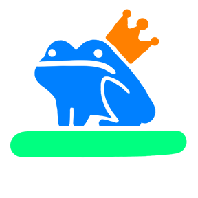

# Intro



MotherTode is a work-in-progress language that lets you make languages. It's a language language.

## How does it work?

Define your language by defining **terms**, like these:

```
let Expression = Number | String
```

```
let Greeting = {
    match "greeting"
    emit "Hello world!"
}
```

## What does it look like?

This is a mini language that lets you add numbers (don't worry if you don't understand it yet):

```
match Number

let Number = Add | Literal
let Literal = /[0-9]/+
let Add = {
    match @(Number & !Add) "+" @Number
    emit (left, right) => left + right
)
```
